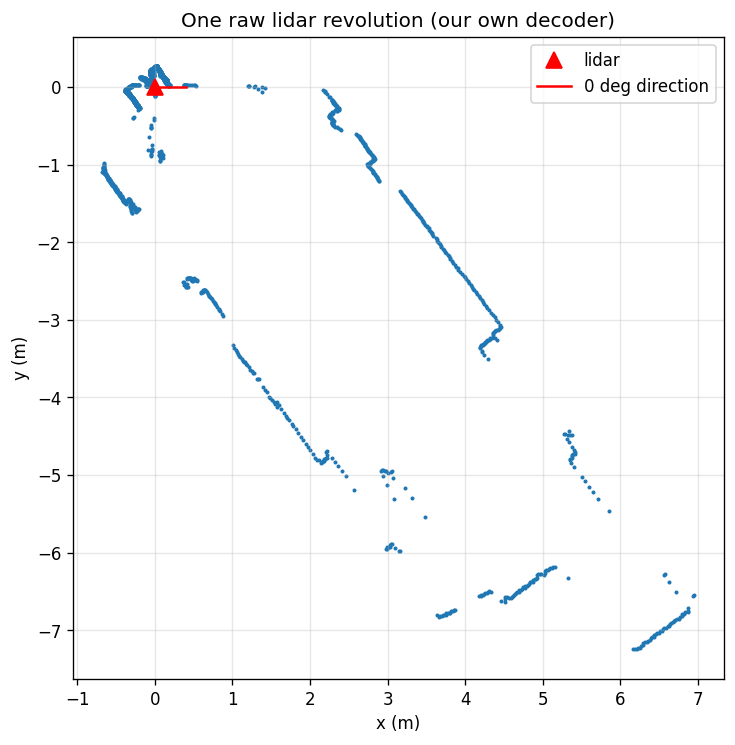
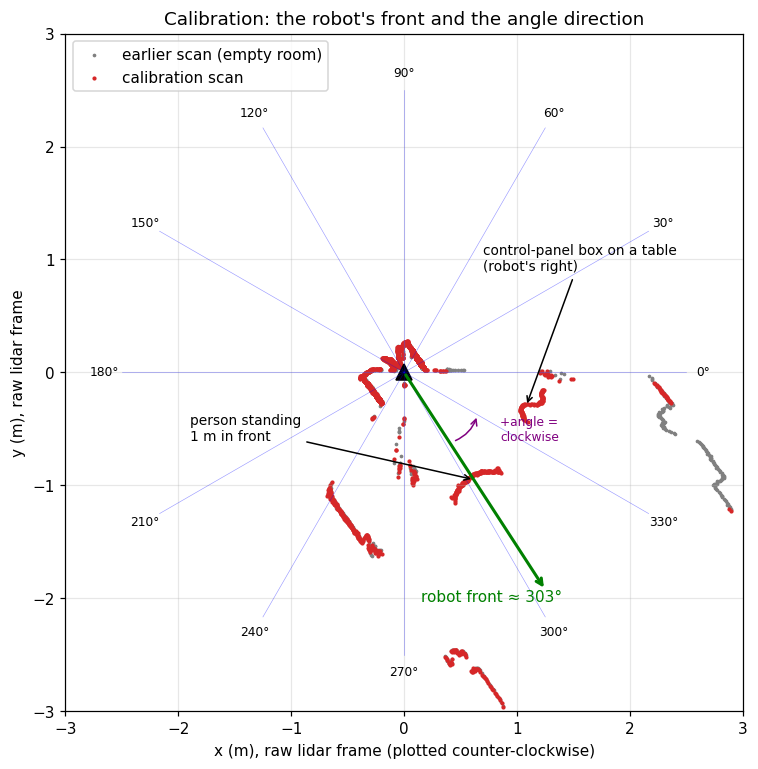

# Autonomous Mapping and Navigation

An open-source research log: teaching a small wheeled robot to **map an unknown room and drive itself around it**, built from scratch by someone who started with zero robotics experience.

This repository is a lab notebook as much as it is code. Every step is recorded here, including the commands we ran, what we learned, what broke and how we fixed it. If you are new to robotics too, you should be able to follow along from the first entry.

> **Status:** Phase 1, talking to hardware. Our own decoder reads raw LiDAR scans, and units and direction are calibrated (see [Entry 2](#entry-2-2026-10-05-calibrating-the-lidar-with-people)).

---

## Table of contents

1. [Goals](#goals)
2. [Philosophy: why from scratch?](#philosophy-why-from-scratch)
3. [The robot](#the-robot)
4. [Software environment](#software-environment)
5. [Roadmap](#roadmap)
6. [Research log](#research-log)
7. [Glossary](#glossary)
8. [License](#license)

---

## Goals

By the end of this project the robot should be able to:

1. **Map:** drive around an unknown indoor space and build a 2D map of it.
2. **Localize:** know where it is on that map at any moment.
3. **Navigate:** given a goal on the map, plan a path and drive there without hitting anything.
4. **Explore:** decide for itself where to go next until the whole space is mapped.

Steps 1 and 2 done together are called **SLAM** (Simultaneous Localization And Mapping). Step 3 is **autonomous navigation**.

## Philosophy: why from scratch?

ROS 2 already ships production-quality tools for all of this (`slam_toolbox`, `cartographer`, `Nav2`). Running them on a robot takes an afternoon, but you learn very little about *why* they work.

So the rule here is:

1. **Build it ourselves first.** Write a simple version of each piece (odometry, mapping, scan matching, path planning) to understand the idea.
2. **Then compare against the real tool.** Run the established package on the same data and measure how far off ours is, and why.
3. **Write everything down** in this README.

The vendor's demo code that came with the robot is used only as a reference, never as the solution.

## The robot

A **Yahboom ROSMASTER R2** with an **NVIDIA Jetson Orin NX Super 8 GB** as its onboard computer.

The R2 uses **Ackermann steering**, like a car: the rear wheels drive and the front wheels turn. This matters a lot later on. Unlike a differential-drive robot it **cannot turn on the spot**, so it has a minimum turning radius that odometry, path planning and path following all have to respect.

| Part | What it is | Role in the project |
|------|------------|---------------------|
| **Chassis** | Yahboom ROSMASTER R2, Ackermann steering (rear-wheel drive, front-wheel steering) | Defines how the robot can move (kinematics) |
| **Compute** | NVIDIA Jetson Orin NX 8 GB (Super dev kit), 6 CPU cores, ~150 GB NVMe SSD | Runs everything on board: drivers, SLAM, planning |
| **2D LiDAR** | YDLIDAR 4ROS, a time-of-flight LiDAR (reports model code 101, firmware 2.1), on a CP2102 USB-serial adapter (`/dev/rplidar`), 512000 baud, ~8 Hz, ~2,500 points per turn | Main sensor for mapping: measures distance to walls 360° around the robot |
| **Depth camera** | Orbbec 3D camera (RGB + depth) | Later: 3D / visual SLAM and obstacle detection |
| **Motor driver board** | Yahboom ROS expansion board (CH340 USB-serial, `/dev/myserial`) | Drives the wheel motors, reports wheel encoders and IMU |
| **Extras** | USB webcam, LED matrix, Bluetooth | Not used for now |


## Repository layout

| Path | What's inside |
|------|---------------|
| `phase1_lidar/` | Phase 1: talking to the LiDAR directly over serial, no driver, no ROS |
| `docs/images/` | Plots and pictures referenced from this README |
| `docs/` | Raw data captured during experiments |

## Software environment

What is installed on the Jetson as of the first check (2026-10-05):

| Component | Version |
|-----------|---------|
| OS | Ubuntu 22.04.5 LTS |
| NVIDIA JetPack / L4T | R36.4.3 (JetPack 6.x) |
| Linux kernel | 5.15.148-tegra |
| CUDA | 12.6 |
| ROS 2 | Humble Hawksbill |
| Python | 3.10.12 |
| PyTorch | 2.5.0 (NVIDIA Jetson build) |
| OpenCV | 4.11 |
| Docker | 27.5 |

ROS 2 packages that are already installed and will be used **for comparison later**: `slam_toolbox`, `cartographer_ros`, `nav2_bringup`, `robot_localization`, `sllidar_ros2` (LiDAR driver), `astra_camera` (Orbbec driver).

### How we work

- Code is written on a laptop in this repository and runs on the Jetson.
- The laptop connects to the Jetson over Wi-Fi with SSH (`ssh jetson@<jetson-ip>`).
- All robots and computers in the same ROS 2 "domain" see each other's data. This robot uses `ROS_DOMAIN_ID=28`.

## Roadmap

Each phase ends with something that works on the real robot, plus a write-up in the log.

| Phase | Topic | What we build | Key concepts |
|:-----:|-------|---------------|--------------|
| 0 | Setup | Hardware inventory, SSH, repo | Jetson, Linux, git |
| 1 | Talking to hardware | Read raw LiDAR scans; send wheel commands over serial ourselves | Serial protocols, sensor data |
| 2 | ROS 2 basics | Our own nodes: LiDAR publisher, motor driver, teleop | Nodes, topics, messages, `tf` |
| 3 | Odometry | Estimate robot pose from wheel encoders (+ IMU) | Kinematics, dead reckoning, drift |
| 4 | Mapping with known poses | Occupancy grid map from scans + odometry | Occupancy grids, log-odds, ray casting |
| 5 | Scan matching | Align consecutive scans to correct odometry | ICP, rigid transforms |
| 6 | SLAM | Pose graph with loop closure | Graph optimization, loop closure |
| 7 | Benchmark | Compare our SLAM vs `slam_toolbox` / `cartographer` | Evaluation, error metrics |
| 8 | Localization | Find the robot on a saved map | Particle filter (AMCL) |
| 9 | Path planning | Global planner on the map | A*, costmaps, inflation |
| 10 | Path following | Drive the planned path, avoid obstacles | Pure pursuit, DWA |
| 11 | Exploration | Autonomous frontier-based exploration | Frontiers, decision making |
| 12 | Beyond | Depth camera / visual SLAM | RGB-D, visual features |

## Research log

Newest entries at the bottom. Every entry records **goal → what we did → what we learned → next step**.

### Entry 0: 2026-10-05, first contact with the robot

**Goal:** Check that the Jetson is reachable and find out what hardware and software we actually have before writing any code.

**What we did**

1. **Connected over SSH.** The two saved addresses for the Jetson no longer answered. The robot gets its IP address from the router by DHCP, so the address had changed. We found it again by scanning the local network for devices with port 22 (SSH) open.
   - *Lesson:* reserve a fixed IP for the robot in the router (DHCP reservation), or use its hostname, so this doesn't keep happening.
2. **Checked the system:** OS, JetPack, CUDA, ROS 2, Python packages (see [Software environment](#software-environment)).
   - Commands: `cat /etc/os-release`, `cat /etc/nv_tegra_release`, `nvpmodel -q`, `nvcc --version`, `ls /opt/ros`.
3. **Checked what's plugged in** with `lsusb` and `ls -l /dev/ttyUSB* /dev/video*`.
   - The RPLidar shows up as `/dev/ttyUSB0`, with a friendly alias `/dev/rplidar`.
   - The Orbbec depth camera shows up as two USB devices (color camera + depth sensor).
   - **The motor driver board is missing.** Its USB-serial chip (CH340, USB ID `1a86:7523`) was not listed, so `/dev/myserial` did not exist.
4. **Learned about udev rules.** Linux names USB serial devices `ttyUSB0`, `ttyUSB1`... in whatever order they are plugged in. To get stable names, `/etc/udev/rules.d/` contains rules that match a device by its USB vendor/product ID and create a symlink such as `/dev/rplidar` or `/dev/myserial`. This is why our code should always open `/dev/rplidar`, never `/dev/ttyUSB0`.
5. **Power mode** is `MAXN_SUPER` (maximum performance). Temperatures at idle are around 48–51 °C.

**Problems found**

- Motor driver board not detected on USB, so the robot cannot move yet. Check the USB cable and the battery/power switch.

**Next step:** Get the motor board connected, then start Phase 1: read raw LiDAR data with our own Python script.

### Entry 1: 2026-10-05, reading the LiDAR with our own code

**Goal:** Get distance measurements out of the LiDAR using only Python and a serial port. No vendor driver, no ROS. If we can decode the raw bytes ourselves, we really understand what the sensor gives us.

**Step 1: which LiDAR is it?**

The Jetson's config said `RPLIDAR_TYPE=4ROS`, which suggests an RPLidar, but reading the vendor's launch file (`laser_bringup_launch.py`) showed that type `4ROS` actually uses `ydlidar_ros2_driver`. So it is a **YDLIDAR 4ROS**, not a Slamtec RPLidar. The vendor config also gave us the serial speed: **512000 baud**.

*Lesson:* don't trust names (`/dev/rplidar`, `RPLIDAR_TYPE`). Trace them back to what the code actually does.

**Step 2: say hello (`phase1_lidar/ydlidar_probe.py`)**

The YDLIDAR protocol is simple:
- A **command** is 2 bytes: `0xA5` followed by a command code.
- A **reply** starts with `A5 5A`, then 4 bytes of length/mode, then 1 byte of type, then the payload.

We sent `A5 90` (get device info) and `A5 92` (get health):

```
$ python3 ydlidar_probe.py
DEVICE INFO (type=0x04, 20 bytes): 65 01 02 01 02 00 02 04 00 09 01 08 00 00 01 00 00 00 09 08
  model code : 101
  firmware   : 2.1
  hardware   : 1
  serial     : 2024091800100098
HEALTH (type=0x06): 00 00 00
  status     : 0 (OK)
```

Model code 101 belongs to YDLIDAR's TG time-of-flight family in their SDK; the 4ROS appears to be built on that core. The serial number starts with a date: made on 2024-09-18.

**Step 3: stream and decode scans (`phase1_lidar/read_scan.py`)**

`A5 60` starts scanning. From then on the LiDAR streams **packets** forever, each one covering a small slice of the circle:

| Bytes | Field | Meaning |
|-------|-------|---------|
| 2 | `PH` | Packet header, always `AA 55`; how we find where a packet starts |
| 1 | `CT` | Bit 0 = 1 marks the start of a new revolution |
| 1 | `LSN` | Number of samples in this packet |
| 2 | `FSA` | Angle of the first sample: `(FSA >> 1) / 64` degrees |
| 2 | `LSA` | Angle of the last sample, same formula |
| 2 | `CS` | Checksum: XOR of every 16-bit word in the packet |
| 2 × LSN | samples | One distance per sample, little-endian uint16 |

The angles of the samples in between are spread evenly from `FSA` to `LSA`. Distance `0` means "no return" (nothing in range, or a surface that didn't reflect).

**A bug, and what it taught us:** the first version crashed with a timeout right after the LiDAR acknowledged the start command. Capturing the raw bytes showed that after the `A5 5A` reply the LiDAR goes **silent for about 1.1 seconds** while its motor spins up to speed, and only then starts sending data. The script waited only 1 second. Fix: allow up to 5 seconds for the first byte.

**Result**

```
$ python3 read_scan.py 20
motor spin-up        : 1.10 s of silence before data
revolutions          : 20
scan rate            : 8.09 Hz
points / revolution  : min 2185, max 2698
angular resolution   : 0.147 deg
bad packets dropped  : 0
valid points (d>0)   : 2252 / 2698
raw distance min/max : 59 / 9643
```



Each dot is one measurement converted from (angle, distance) to (x, y):
`x = d·cos(θ)`, `y = d·sin(θ)`. The long straight lines are walls; the cluster close to the red triangle is probably the robot's own body and mast getting in the way. The raw data for this picture is in [`docs/phase1_first_scan.csv`](docs/phase1_first_scan.csv).

**What we learned**

- **Zero corrupt packets** out of hundreds: every checksum matched, so our understanding of the packet layout is correct.
- ~8 revolutions per second × ~2,500 points ≈ **20,000 measurements per second**.
- About 16 % of the points are `0` (no return). Real sensors always have holes, so later code must ignore them.
- The walls come out as **straight lines**, a good sign that the angle decoding is right.

**Still to verify (needs someone next to the robot)**

1. **Units:** we assumed 1 raw unit = 1 mm. The walls look the right size, but this needs a tape measure: put a box at a measured distance and compare.
2. **Which way is 0°, and which way do angles increase?** YDLIDAR angles grow **clockwise**, while ROS uses **counter-clockwise** angles, so our picture may be mirrored. Test: put an object on the robot's left and check where it shows up.
3. **Self-hits:** find out exactly which angles hit the robot's own body, so we can mask them out.

**Next step:** do the three checks above, then Phase 2: wrap our decoder in our own ROS 2 node that publishes `sensor_msgs/LaserScan`, so we can view it in RViz.

### Entry 2: 2026-10-05, calibrating the LiDAR with people

**Goal:** Answer the open questions from Entry 1. Are the distances in millimetres? Which LiDAR angle is the robot's front? Do angles grow clockwise or counter-clockwise?

**What we did**

1. One person stood exactly in front of the robot at 1 m. A second person sat beside them, and a control-panel box sat on a table to the standing person's left.
2. We captured a new scan (`read_scan.py 10`) and compared it with the earlier scan from Entry 1, when nobody was there.
3. For every 1° slice of the circle we looked for points that were now **much closer** than before (more than 15 cm). Anything new in the room shows up this way. This is called **background subtraction**.



**Two new objects appeared**

| LiDAR angle | Distance | Shape | What it is |
|-------------|----------|-------|------------|
| 291°–314° (centre **~303°**) | 1.09–1.24 m (median 1.12 m) | Edge ~45 cm wide | **The standing person's legs and feet.** The LiDAR sits only ~11 cm above the floor, so it sees ankles, not bodies |
| 338°–353° (centre ~346°) | 1.08–1.26 m | Rounded blob ~30 cm wide | A control-panel box on a table, on the person's left, which is the **robot's right** |

The seated person did not show up as a separate object.

> **A mistake worth recording.** The first time through, we guessed the labels the other way round: the rounded blob was "obviously" legs, so it had to be the person. That gave a front of 345° and "counter-clockwise" angles, both wrong. The person in the room corrected it. Lesson: **a scan is just dots. Never label objects by guessing what their shape "looks like"; check against what is actually in the room.** A cleaner experiment uses a single object and one change at a time.

**Conclusions**

- **Units: 1 raw unit = 1 mm.** The person was 1 m from the front of the robot; the nearest leg points measured 1.09 m from the LiDAR's centre, which sits a little behind the front. (Feet are a fuzzy target; a flat box and a tape measure would be more precise.)
- **The robot's front is at about 303° in the LiDAR's own angles, not 0°.** The LiDAR's zero mark is about 57° away from straight ahead.
- **Angles increase clockwise** (seen from above). The box on the robot's **right** appeared at a **higher** angle (346°) than the front (303°). This matches YDLIDAR's documentation, but it is the **opposite** of ROS, where angles increase counter-clockwise (REP 103: x forward, y left). So the scan must be **mirrored** when converting to ROS.

Putting both corrections together, the angle as ROS expects it (0 = straight ahead, positive = to the left) is:

```
angle_robot = 303° - angle_lidar
```

Check with the box: 303° − 346° = −43°, a negative angle, which is the robot's right. ✓

*Note:* the plot above draws raw angles counter-clockwise like a normal maths graph, so in it the room appears mirrored.

The raw data for this experiment is in [`docs/phase1_person_1m.csv`](docs/phase1_person_1m.csv).

**Still open**

- Measure the front offset more precisely with a single flat box placed dead ahead.
- Re-confirm the clockwise direction with one object at a time (this time we'll see it live in RViz).
- Find which angles hit the robot's own body (the points within ~30 cm of the LiDAR) so we can mask them out.

**Next step:** Phase 2, our own ROS 2 node that publishes the scan as `sensor_msgs/LaserScan` using `angle_robot = 303° − angle_lidar`. In RViz we can then double-check the direction live by walking to the robot's left and right.

## Glossary

Terms are added as they come up in the log.

| Term | Meaning |
|------|---------|
| **SLAM** | Simultaneous Localization And Mapping: building a map while figuring out where you are in it, at the same time |
| **LiDAR** | A spinning laser rangefinder that measures the distance to surrounding objects |
| **ROS 2** | Robot Operating System 2, a framework that lets separate programs (nodes) on a robot exchange data |
| **Jetson** | NVIDIA's small, low-power computer with a GPU, built for robots and edge AI |
| **JetPack / L4T** | NVIDIA's software bundle for the Jetson (Linux for Tegra + CUDA + drivers) |
| **SSH** | Secure Shell: logging into another computer's terminal over the network |
| **DHCP** | How a router hands out IP addresses automatically; the address may change between boots |
| **udev rule** | A Linux rule that gives a USB device a stable name such as `/dev/rplidar` |
| **Ackermann steering** | Car-like steering: front wheels turn, the robot drives along arcs and cannot rotate in place |
| **Odometry** | Estimating how far the robot has moved, e.g. by counting wheel rotations |
| **Time of flight (TOF)** | Measuring distance by timing how long a light pulse takes to bounce back |
| **Baud rate** | Speed of a serial connection in bits per second (here 512000) |
| **Packet** | A small chunk of data with a fixed layout: header, fields, payload, checksum |
| **Checksum** | A value computed from the data, sent along with it, so the receiver can detect corruption |
| **Little-endian** | Multi-byte numbers are sent lowest byte first: `0x55AA` travels as `AA 55` |
| **Background subtraction** | Comparing a scan with an earlier "empty" scan; whatever is closer now is something new |
| **REP 103** | The ROS standard for units and directions: metres, radians, x forward, y left, z up, angles counter-clockwise |
| **Occupancy grid** | A map made of small squares, each marked free, occupied or unknown |

## License

[GNU General Public License v3.0](LICENSE). You are free to use, study, share and modify this work, as long as derivatives stay open under the same license.
